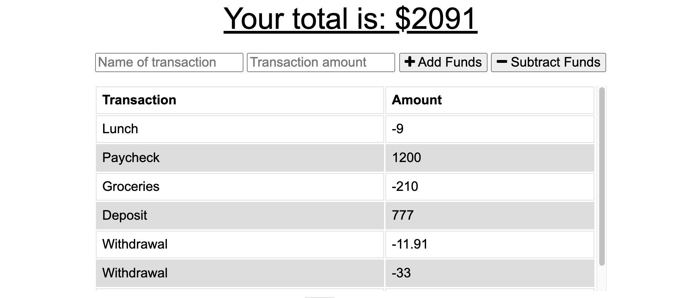
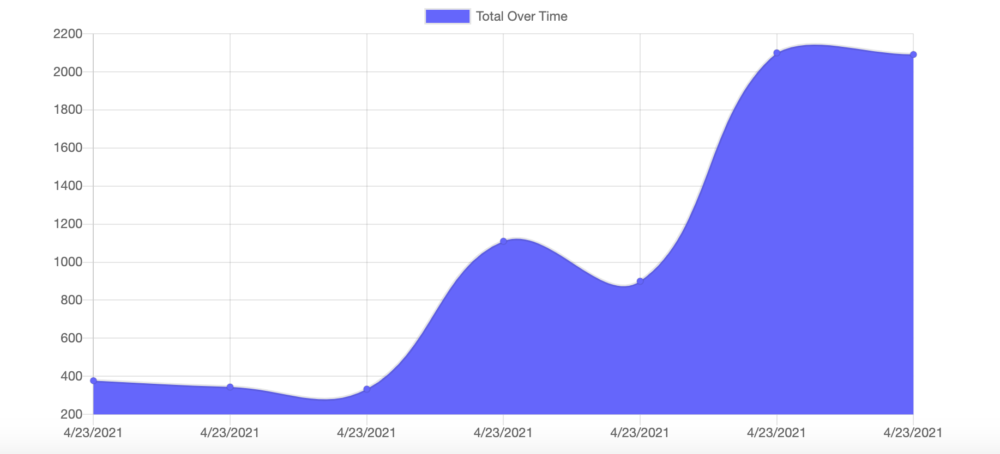
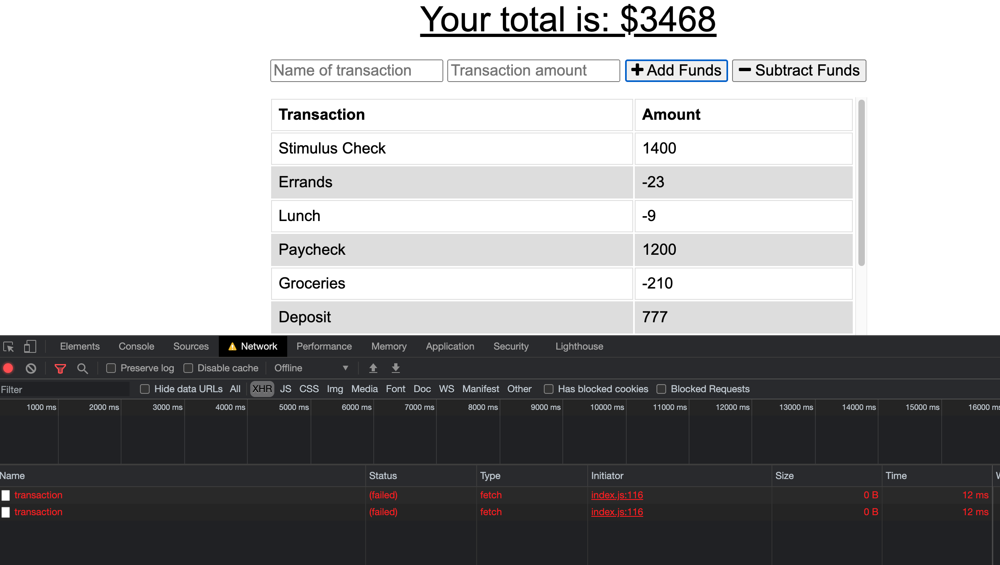
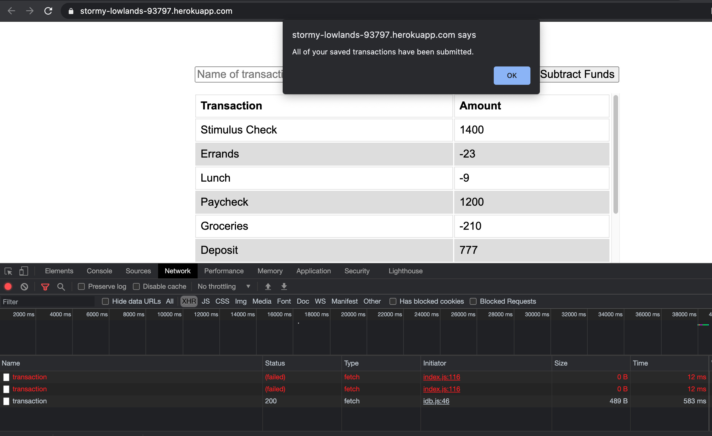

  # Budget Tracker
  

  
  ## Description: 

  Budget Tracker is an app (PWA) that allows the user to track any money that is gained or spent. It lists the expenses and provides a graph with a visual of the user's spending over a period of time. The app utilizes `IndexedDB` to cache network requests when offline and submit them when a network connection becomes available again. It also utilizes `Express.js` for server instantiation, `MongoDB` for its database, and `Mongoose` for model creation.
  \
  \
  
  \
  
  \
  
  \
  
  
  

   

  ## Table of Contents:
  * [Installation](#installation)
  * [Usage](#usage)
  * [Contributing](#contributing)
  * [Questions?](#questions)
  
  ## Installation: 
 
  The app is deployed to `Heroku` at https://stormy-lowlands-93797.herokuapp.com/ and can be installed as a PWA via the browser by clicking the box containing an arrow on the far right of the address bar.
  

  
  ## Usage: 

  The user can track any money that they spend or any money that they receive, and track their budget via the values displayed in the table or the graph which provides a visual representation of their budget over time. 
  

  
  ## Contributing: 

  Please create a pull request to contribute any ideas or modifications that you may have. 
  

  
  
  ## Questions?:
  * <a href="https://github.com/gwarzecha" target="_blank">GitHub</a>
  * <a href="mailto: gmwarzecha@tutanota.com" target="_blank">Email</a>
  
  ## License: 

  This project is covered under the MIT license.
  